# Assignment 1 Submission

To run the full Assignment 1 simulation and modeling script, the script can be directly executed with Python:
```console
uv run assignment_1.py
```
Running the script will generate an `output` directory with copies of many of the particularly expensive (or required) generated plots.
Please be aware that, by default, the script will generate several Regions of Attraction plots, which take a while to compute. If you don't want that, there is a flag shortly before the spokes and inclinations sweep that can be disabled to prevent it.

Inside a script, the rimless wheel model can be used just like the pendulum model:
* `generate_params()` can be used to generate a dict of params that the model expects for its dynamics and energy calculations
* `calculate_energy(state, params)` will calculate the kinetic and potential energy values associated with the provided `state` (a 2xn numpy array), given the dict `params` as generated by `generate_params()`.
* `dynamics(t, state, params, poincare_section=None)` can be used to calculate the instantaneous derivatives for the model's state variables. `t` is the time value, `state` is a 2x0 numpy array representing the system state, `params` is a dict as generated by `generate_params()`, and `poincare_section`, if not None, will fill a provided list with the states the system exhibited just after each spoke collides with the surface.

## Sanity Checks
Basic sanity checks can be confirmed by looking at three plots:
1. Angle trajectory plot: The angle should increase monotonically and then be reset to a negative value when the next spoke contacts the ground

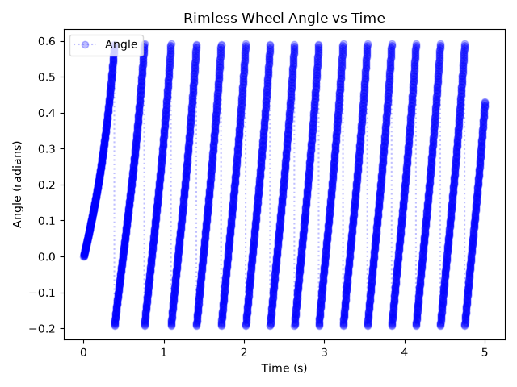

2. Phase portrait: The phase portrait should start at the initial point and travel to a limit cycle

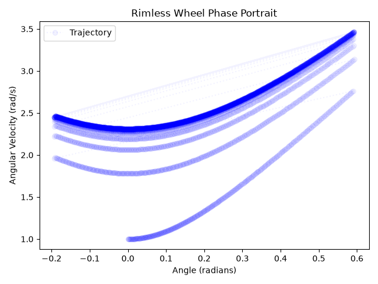

3. Energy plot: The total system energy should eventually reach a steady equilibrium or cycle (if this energy were relative to a fixed reference frame, the potential energy would keep decreasing, but I have written it to travel with the wheel so potential energy is only relative to the surface of the slope)

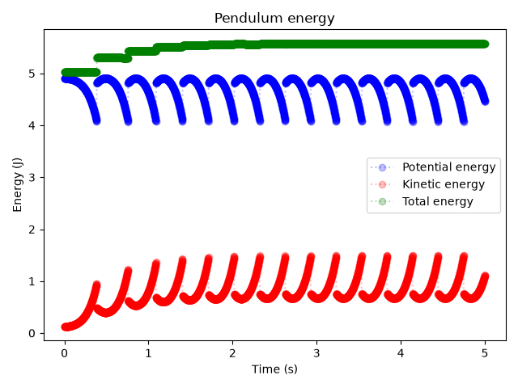

## Regions of Attraction
When investigating the rimless wheel's regions of attraction, a plot like this is generated:

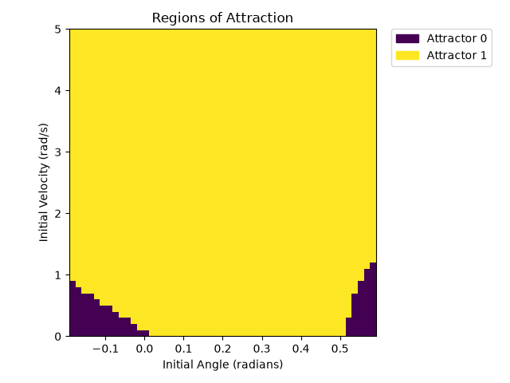

This wheel rolled down a slope of inclination 0.12 radians and had 8 spokes of length 0.5 meter. Its center weighed 1 kg. In this plot, Attractor 0 is a fixed point representing the wheel not having enough momentum to go over its spoke and just resting for all eternity.

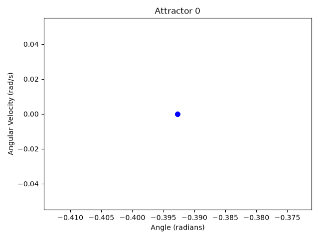

Attractor 1 is the limit cycle produced as the wheel rolls down the slope. The gap in the plot of the attractor is just where the automatic cycle-finder was able to match the cycle and didn't need to evaluate further.

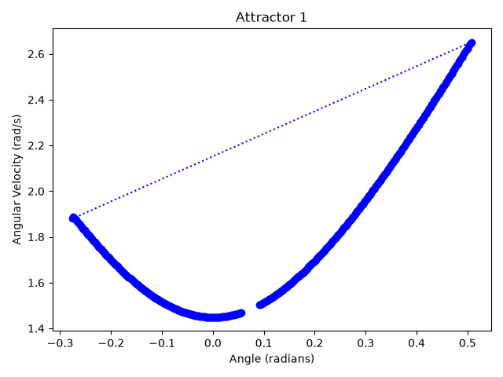

When the script is actually run, plots of these attractors in phase-space are generated and saved in the `output` directory.

## One-Dimensional Return-Map
The one-dimensional return map shows the angular velocity after collision plotted against the angular velocity before collision.
This plot represents the same rimless wheel system as was discussed for the above Regions of Attraction plot.

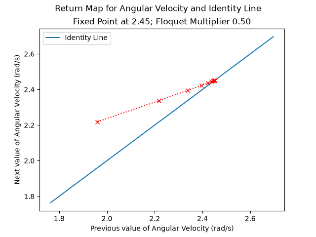

For this set of parameters, the fixed point appears to be 1.88. 

The slope at the fixed point, calculated using perturbations of +/-0.1 radians/second, is 0.50. Since this value is less than 1, we know that the system converges to a fixed point instead of blowing up.

## Effect of slope and number of spokes on Regions of Attraction and local convergence

As the number of spokes increases, the wheel begins to behave more like a full circle as less energy is loss with each collision due to better alignment of the contact angle and spoke. This can be seen in the fixed point of the return map, which increases in value as the wheel gains more spokes and more energy is preserved between contacts. The value of the Floquet multiplier also increases.
The angle between spokes becomes smaller, so the regions of attraction map appears to "shrink".
The following two images correspond to a wheel with only 6 spokes:

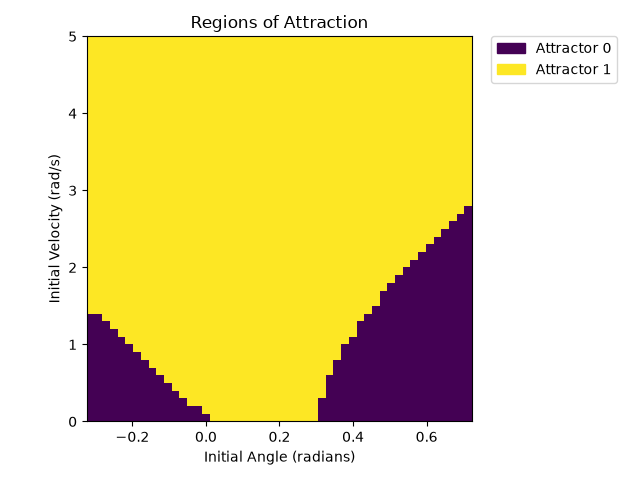

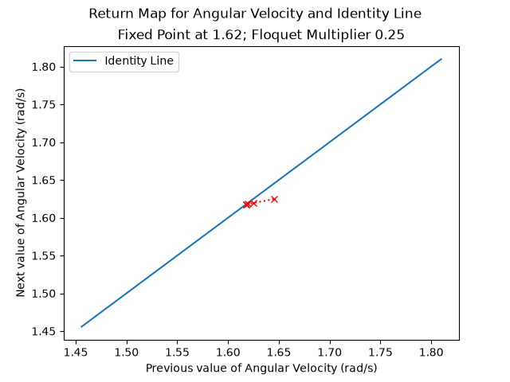

The next two plots are for a wheel with 12 spokes:

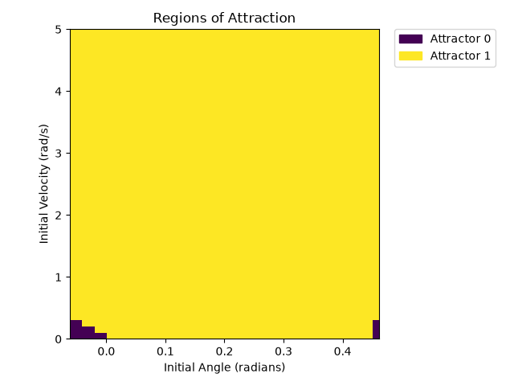

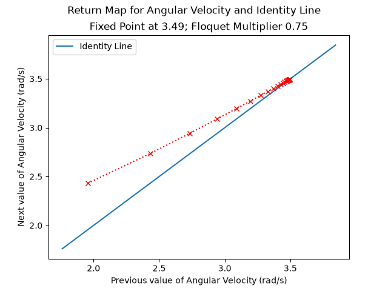


When the slope inclination changes, we observe different effects on the Regions of Attraction and Return Map plots.

For very shallow slopes, the wheel loses too much energy during contact to achieve a stable roll, so we will look at a minimum slope angle of 0.12 radians.


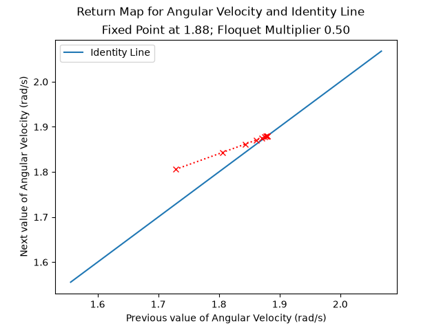

We can compare these to the same plots for a slope angle of 0.35 radians, which is on the upper end of what the wheel can roll down without coming off of the slope.

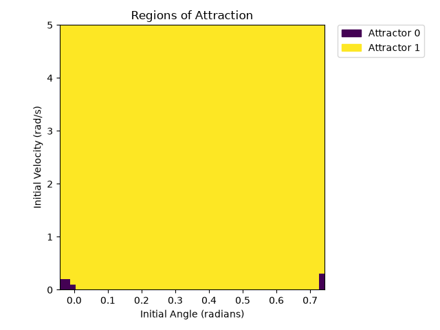

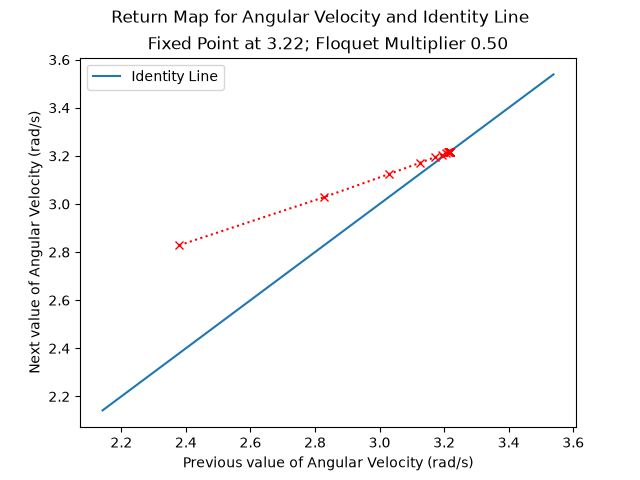

From these plots, we can see that the angle of the slope has a strong effect on the shape of the regions of attraction and on the value of the return map fixed point, but not on the Floquet multipler.

With a shallow slope, the wheel gains less energy per cycle and has much larger regions that result in coming to a stop. The fixed point for the return map is at a lower value because of the reduced available energy.

With a steep slope, the wheel moves much faster during its cycle, and the return map fixed point value is much higher. The regions of attraction that lead to static equilibrium are much smaller.

