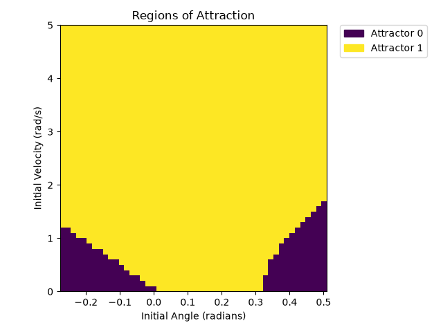
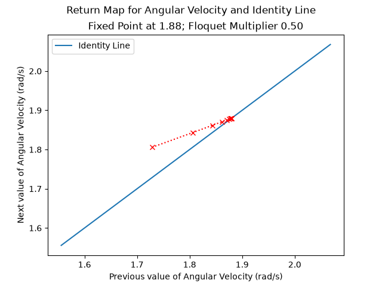

# Assignment 1 Submission

To run the full Assignment 1 simulation and modeling script, the script can be directly executed with Python:
```console
uv run assignment_1.py
```
Running the script will generate an `output` directory with copies of many of the particularly expensive (or required) generated plots.
Please be aware that, by default, the script will generate several Regions of Attraction plots, which take a while to compute. If you don't want that, go find that part of the code and comment it out (*now that's what I call user-friendly*).

Inside a script, the rimless wheel model can be used just like the pendulum model:
* `generate_params()` can be used to generate a dict of params that the model expects for its dynamics and energy calculations
* `calculate_energy(state, params)` will calculate the kinetic and potential energy values associated with the provided `state` (a 2xn numpy array), given the dict `params` as generated by `generate_params()`.
* `dynamics(t, state, params, poincare_section=None)` can be used to calculate the instantaneous derivatives for the model's state variables. `t` is the time value, `state` is a 2x0 numpy array representing the system state, `params` is a dict as generated by `generate_params()`, and `poincare_section`, if not None, will fill a provided list with the states the system exhibited just after each spoke collides with the surface.

## Sanity Checks
Basic sanity checks can be confirmed by looking at three plots:
1. Angle trajectory plot: The angle should increase monotonically and then be reset to a negative value when the next spoke contacts the ground
2. Phase portrait: The phase portrait should start at the initial point and travel to a limit cycle
3. Energy plot: The total system energy should eventually reach a steady equilibrium or cycle (if this energy were relative to a fixed reference frame, the potential energy would keep decreasing, but I have written it to travel with the wheel so potential energy is only relative to the surface of the slope)

## Regions of Attraction
For the default parameters of the rimless wheel, a plot like this is generated:



In this plot, Attractor 0 is a fixed point representing the wheel not having enough momentum to go over its spoke and just resting for all eternity.
Attractor 1 is the fixed point where the wheel is perfectly balanced on one spoke; this is a very unstable equilibrium.
Attractor 2 is the limit cycle produced as the wheel rolls down the slope.
When the script is actually run, plots of these attractors in phase-space are generated and saved in the `output` directory.

## One-Dimensional Return-Map
The one-dimensional return map shows the angular velocity after collision plotted against the angular velocity before collision.
The live version of the plot includes labels for each point denoting their order.
This plot represents a wheel simulated with my default params.



The fixed point appears to be about 2.48.

## Effect of slope and number of spokes on Regions of Attraction and local convergence
tbd!