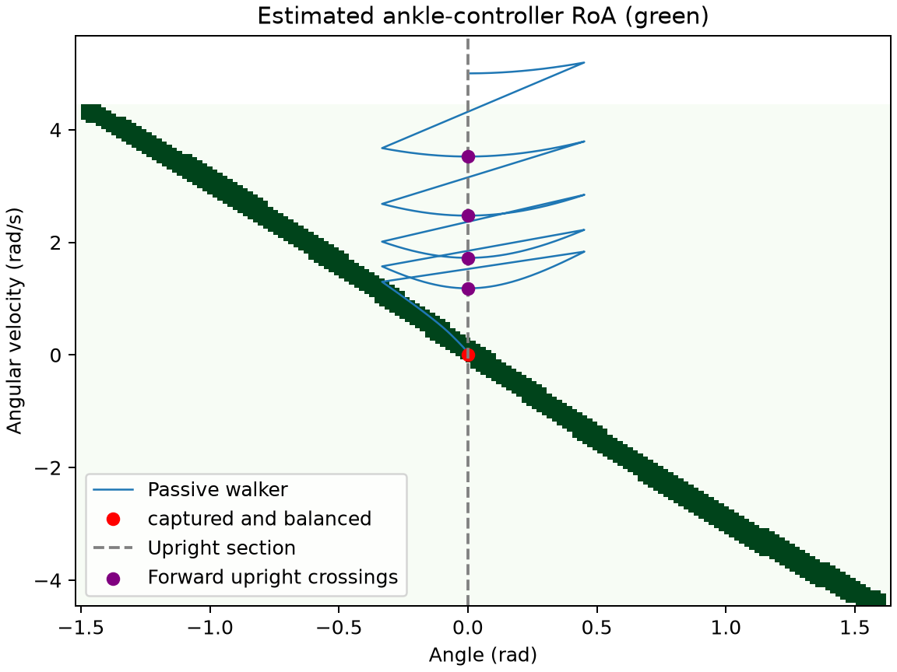

## Initial Sketches

## Ankle controller and region of attraction

Feedback linearization cancels gravity's $(g/l)\sin\theta$ and imposes the critically damped dynamics $\ddot{\theta} = -(g/l)\,\theta - 2\sqrt{g/l}\,\dot{\theta}$, saturated to $\tau \in [-0.1,\ 0.05]\,mgl$. The RoA grid spans $\theta \in [\gamma - \pi/2,\ \gamma + \pi/2]$ (ground to ground, where $\gamma$ is the incline) and $\dot{\theta} \in [-\sqrt{2g/l},\ \sqrt{2g/l}]$, with $161 \times 161$ points. A state counts as inside only if all four corners of its cell reach standstill, which accepts 1021 of 25600 cells. Re-simulating 5105 interior points of accepted cells gave 0 failures. Because the torque limits are small, the RoA is simply a thin band going across the center. On the section, velocities up to $\dot{\theta} = 0.276$ rad/s can be captured without a step.

## Poincare section

I defined the Poincaré section at the upright vertical position ($\theta = 0$) with a positive forward velocity ($\dot{\theta} > 0$). Because of the stipulation that $\dot{\theta}$ must be greater than 0, the flow must cross this section transversely. Furthermore, since the minimum allowed landing angle ($\alpha_{min} = \pi/8$) is strictly greater than the slope incline ($\gamma = 0.06$ rad), this upright position always lies between the post-impact angle ($\gamma - \alpha < 0$) and the touchdown angle ($\gamma + \alpha > 0$). The walker will cross this section exactly once every step which allows me to define the return map using solely the mid-stance velocity $v_k = \dot{\theta}$.  The landing angle $\alpha$ is selected at each section crossing and held constant until touchdown occurs. The stabilizing ankle torque $\tau$ remains zero (inactive) until the system state enters the RoA. The passive walking dynamics on the incline will dissipate energy so every returning step slows the walker ($v_{k+1} < v_k$). Thus, the return map possesses no fixed points which guarantees the maximum number of steps before capturing the system is finite.

## Grid resolution

The criteria were fixed before the sweep. On 120 section velocities offset into grid cells, every continuous rollout must capture. At least 99% of the rollouts must also match the fine reference policy's footstrike count, and at least 99% must match the table's own prediction. The reference grid is $641 \times 81$ with $\Delta t = 0.0005$ s. The candidate tables and rollouts use $\Delta t = 0.001$ s.

Selected: the coarsest passing grid, $181 \times 46$, with 120/120 reference and 119/120 prediction matches.

The next coarser grid, $161 \times 41$, fails on prediction agreement: 120/120 captured, 120/120 reference and 117/120 prediction matches.

| Grid | Cells | Captured | Reference matches | Prediction matches | Result |
|---|---:|---:|---:|---:|---|
| $21 \times 6$ | 126 | 120 | 120 | 112 | fails prediction agreement |
| $41 \times 11$ | 451 | 120 | 120 | 115 | fails prediction agreement |
| $61 \times 16$ | 976 | 120 | 120 | 116 | fails prediction agreement |
| $81 \times 21$ | 1701 | 120 | 120 | 118 | fails prediction agreement |
| $101 \times 26$ | 2626 | 120 | 120 | 118 | fails prediction agreement |
| $121 \times 31$ | 3751 | 120 | 120 | 118 | fails prediction agreement |
| $161 \times 41$ | 6601 | 120 | 120 | 117 | fails prediction agreement |
| $181 \times 46$ | 8326 | 120 | 120 | 119 | pass |
| $201 \times 51$ | 10251 | 120 | 120 | 120 | pass |
| $221 \times 56$ | 12376 | 120 | 120 | 119 | pass |
| $241 \times 61$ | 14701 | 120 | 120 | 119 | pass |
| $321 \times 81$ | 26001 | 120 | 120 | 119 | pass |

This is the coarsest grid among those tested, not a proof that every other grid fails. Errors are not monotone under refinement, because capture and integer step counts change at boundaries.

## Independent checks

- roa_interior_samples: 5105
- roa_failures: 0
- table_outcome_changes: 7
- table_count_changes: 0
- max_return_velocity_error: $3.74 \times 10^{-12}$ rad/s
- holdout_trials: 120
- holdout_captured: 120
- holdout_reference_matches: 120
- holdout_timestep_matches: 120

## Steps to standstill

Capture edges seed the table. Each Bellman sweep then adds the section velocities that can reach standstill in one more footstrike. The right panel below shows the result for every $(v_k, \alpha)$ pair.

From initial conditions before the section, 81% of the $(\theta_0, \dot{\theta}_0)$ grid reaches standstill under the fewest-steps policy, needing at most 3 footstrikes.

## Example: fewest and most footstrikes

From $[\theta, \dot{\theta}] = [0, 4]$ (rad, rad/s), the fewest-steps policy stands still after 3 footstrikes. The most-steps policy keeps walking for 5 footstrikes before capture. Both continuous rollouts stand still with exactly the table's counts, and the fine reference policy gives the same counts. These are optima of the grid policy, not proofs of global optimality over continuous $\alpha$.

